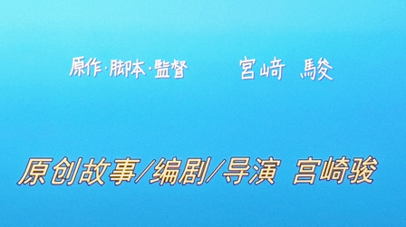

# 你想活出怎样的人生

## 预售

这片子很早就想看了，但是碍于没在中国大陆正式上映一直都没看各种各路的解析。

忍住了。

## 定档

今天是四月三号，定档了今天，但是上个礼拜就已经订好了票，看到开了预售就买了。

## 取票

到了电影院，有看到了老面孔，取了票，领了票根，寒暄了一下。

## 看

落座，关灯，开始

放歌，开灯，散场

::: danger
剧透警告
:::

::: details

怎么说呢，老实来说这应该是我看过的最难懂的宫崎骏电影了，如果说哈尔的移动城堡是能九分理解的话，这部应该只能理解到六七分。

故事比较跳跃，脉络不是特别清晰，就比如一开场就是一场火灾，男主在奔向火中救母的时候镜头一切就到了几年之后，爸爸找了个新老婆。

还有就是后妈和亲妈长得好像，后妈的房子好大，还有苍鹭，而且还是母亲的妹妹（？）。

两个小时一百二十分钟的电影，用了四十五分钟才进入第二幕，之前一直都在讲男主怎么怎么样，是个什么样的小孩子，直到苍鹭开始说话。

“恭候你的到访”，说完这句话就飞到了一座塔上，男主也就被吸引到了这座塔里，但是在入口的时候就婆婆们叫住了。

随后就是苍鹭的骚扰，男主的神经紧绷。

然后进入第二幕的契机来了，后妈失踪，但是男主看着她孤身走入森林。

于是乎，男主带着一位婆婆进入森林找后妈，看到了为他而开的塔门。

跟随着苍鹭进入塔中，塔主让苍鹭带路，于是三人沉入塔底。

第二幕开始。

男主从天空落至沙滩，被迫挤进坟墓，扬帆人出手相救，并且感觉她对这个地方了如指掌，也知道一些此处的禁忌，后续得知此人正式是带进来的婆婆。

然后就到了她家，晚上就看哇啦哇啦起飞，男主就问她，她就说这是去投胎，所以这个地方应该是阴间？投胎去上面？

然后就看到鹈鹕吃哇啦，后面一个火美来拯救哇啦，不至于全部吃完。

然后话锋一转，讲外面翻了天，同一时间三个人都消失了（他们叫神隐），然后有个婆婆说其实那个塔不是人造的。

说是外面掉下来的，舅公找着了，着魔了，消失了。

亲妈之前也是这样消失在塔里，但是一段时间之后回来了。

然后回到男主这边，回到主线要去找后妈，路上碰到一群鹦鹉，磨刀霍霍向男主。

危机时刻火美出现，烧的鹦鹉屁滚尿流，伸出手直接回到家，同时得知后妈是火美的妹妹，那么到这就知道火美应该就是男主的亲妈。

第三幕开始，到这里还有半个小时

第三幕节奏极快，一上来火美带着男主找门，说这扇门打开就能回去，结果打开到一半鹦鹉来了，只能开门出去手搭在门把手上。

这时爸爸找来了，但是想回去已经晚了，鹦鹉直接冲了出来，离开了塔的鹦鹉变成了真的鹦鹉。

然后火舞带着男主去看后妈，后妈躺床上生孩子，结果墙壁石头不乐意了，给了男主和火舞一个大逼兜，直接打的不省人事。鹦鹉直接捡漏。

然后镜头一转，男主到了塔顶，遇到了舅公，舅公开始神神叨叨说要不要当我的接班人。

再然后就醒了过来，被绑在鹦鹉窝，然后一开始的苍鹭来救人。

两人逃出，发现火美被绑住献给塔主。

于是两人一路向上，去找塔主和鹦鹉大王，

然后塔主让男主搭积木，男主不想，大王搭完就塌了，绷不住了，一刀下去，整个世界被切开。

再然后就是逃命，逃到了门口，两个门，四个人，各自回家。

最后就是男主把书放进书包，关上房门，全片结束。

:::

## 感觉

对吧，还是挺难懂的，没有其他的宫崎骏电影通俗易懂。

故事线混乱，前期节奏慢，后期节奏起飞，镜头跳跃。

可以说宫老完全的表达，十分的意识流，很多地方都没有完整的交代清楚。都是一笔掠过。

就比如后妈是亲妈的妹妹，火舞是夏子的姐姐。这些台词都是一句话就结束了，

而且有的时候感觉主角懂得比观众都多，又比如雾子婆婆他一眼就认出来了，我是等他说出这句台词我才知道这个救人的人就是刚刚还喊着不想去塔中世界的婆婆。

还有很多很多隐喻，很多很多彩蛋，又是一部次次看次次感觉不一样的电影。

《你想活出怎样的人生》-宫崎骏 20240403 

个人评分 7.5/10
